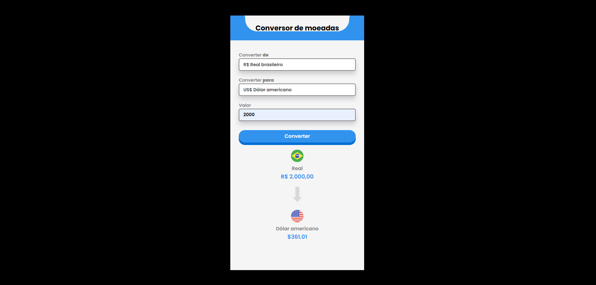

# 💱 Conversor de Moedas

Projeto de um **conversor de moedas** desenvolvido com **HTML, CSS e JavaScript**, que permite converter valores em Real (BRL) para **Dólar (USD)** e **Euro (EUR)**.

## 🚀 Funcionalidades

- Converter valores de Real para:
  - US - Dólar americano
  - EU - Euro
- Formatação automática de moedas
- Interface simples e intuitiva
- Alteração dinâmica da moeda selecionada

## 🛠️ Tecnologias utilizadas

- HTML5  
- CSS3  
- JavaScript (ES6+)
- Intl.NumberFormat (API nativa do JS)

## 📷 Preview do projeto

  

## 🔗 Acesse o projeto

- **Deploy:** https://caioxdev.github.io/Conversor-de-Moedas/  
- **Repositório:** https://github.com/caioxdev/Conversor-de-Moedas